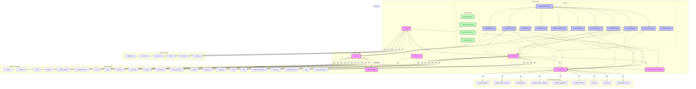

```mermaid
graph TD
    subgraph "Accounts App"
        BU[BotUser] --> UP[UserProfile]
        BU --> TS[TrainingSettings]
        BU --> SUB[Subscription]
        UP --> |has| TS
        UP --> |has| IEC[InjuryExerciseClassification]

        subgraph "Services"
            WS[WorkoutValidator]
            WPG[WorkoutPlanGenerator]
            ES[ExerciseSelector]
            WU[WorkoutUtils]
            DC[DateConverter]
            SRM[SplitRotationManager]
            WE[WorkoutExporter]
            WG[WorkoutGenerator]
            MM[MobilityManager]
            RM[RecoveryManager]
            VM[VolumeManager]
            WC[WeightCalculator]

            subgraph "Split Strategies"
                BS[BroSplitStrategy]
                PPL[PushPullLegsStrategy]
                ULS[UpperLowerStrategy]
                FBS[FullBodyStrategy]
            end
        end
    end

    subgraph "Exercises App"
        EX[Exercise] --> EI[ExerciseImage]
        EX --> |classified by| IEC
    end

    subgraph "Bot App"
        SUB --> |manages| BU
    end

    %% Relationships between services
    WPG --> ES
    WPG --> VM
    WPG --> MM
    WPG --> RM
    WPG --> WS
    WPG --> WG
    WPG --> WE
    WPG --> DC
    WPG --> SRM

    %% Service to Model relationships
    ES --> EX
    ES --> UP
    ES --> TS
    ES --> IEC

    VM --> UP
    VM --> TS

    MM --> EX
    MM --> UP
    MM --> TS

    RM --> UP
    RM --> TS

    WS --> EX
    WS --> UP
    WS --> TS

    WE --> UP
    WE --> TS
    WE --> EX

    %% Model Details
    classDef model fill:#f9f,stroke:#333,stroke-width:2px
    classDef service fill:#bbf,stroke:#333,stroke-width:2px
    classDef strategy fill:#bfb,stroke:#333,stroke-width:2px

    class BU,UP,TS,SUB,EX,EI,IEC model
    class WS,WPG,ES,WU,DC,SRM,WE,WG,MM,RM,VM,WC service
    class BS,PPL,ULS,FBS strategy

    %% Model Attributes
    subgraph "BotUser Model"
        BU --> |has| BU_telegram_id[telegram_id]
        BU --> |has| BU_username[username]
        BU --> |has| BU_first_name[first_name]
        BU --> |has| BU_phone[phone]
        BU --> |has| BU_last_name[last_name]
        BU --> |has| BU_created_at[created_at]
    end

    subgraph "UserProfile Model"
        UP --> |has| UP_gender[gender]
        UP --> |has| UP_height[height_cm]
        UP --> |has| UP_weight[weight_kg]
        UP --> |has| UP_age[age]
        UP --> |has| UP_goal[goal]
        UP --> |has| UP_body_fat[body_fat_percentage]
        UP --> |has| UP_body_type[body_type]
        UP --> |has| UP_activity[daily_activity_level]
        UP --> |has| UP_aura[aura]
        UP --> |has| UP_last_training[last_training_date]
    end

    subgraph "TrainingSettings Model"
        TS --> |has| TS_experience[experience_level]
        TS --> |has| TS_days[training_days_per_week]
        TS --> |has| TS_days_list[training_days]
        TS --> |has| TS_duration[training_duration_minutes]
        TS --> |has| TS_equipment[available_equipment]
        TS --> |has| TS_location[preferred_location]
        TS --> |has| TS_injuries[injuries]
        TS --> |has| TS_split[split_type]
        TS --> |has| TS_rotation[split_rotation_weeks]
    end

    subgraph "Exercise Model"
        EX --> |has| EX_name[name]
        EX --> |has| EX_aliases[aliases]
        EX --> |has| EX_muscles[primary_muscles]
        EX --> |has| EX_secondary[secondary_muscles]
        EX --> |has| EX_force[force]
        EX --> |has| EX_level[level]
        EX --> |has| EX_mechanic[mechanic]
        EX --> |has| EX_equipment[equipment]
        EX --> |has| EX_category[category]
        EX --> |has| EX_instructions[instructions]
        EX --> |has| EX_persian[name_in_persian]
    end

    subgraph "Subscription Model"
        SUB --> |has| SUB_active[is_active]
        SUB --> |has| SUB_expires[expires_at]
    end
```
